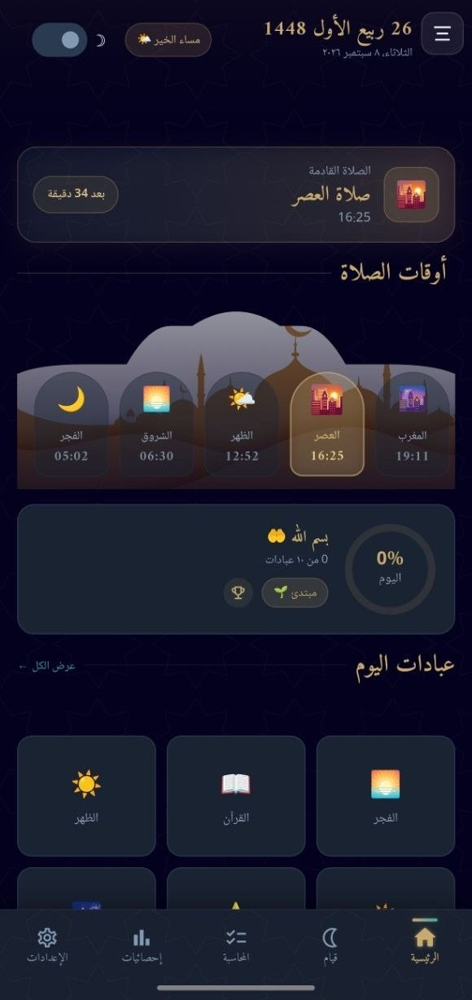
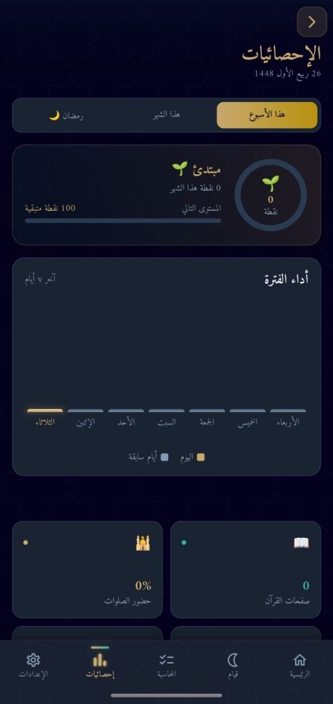
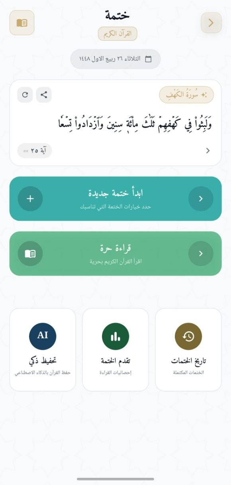
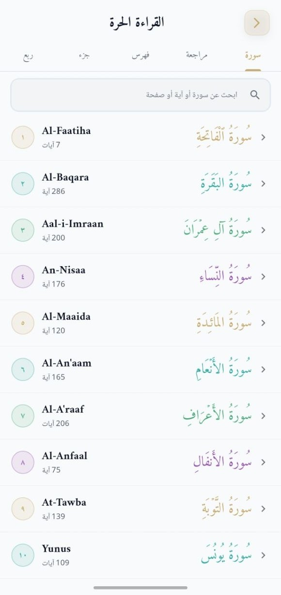
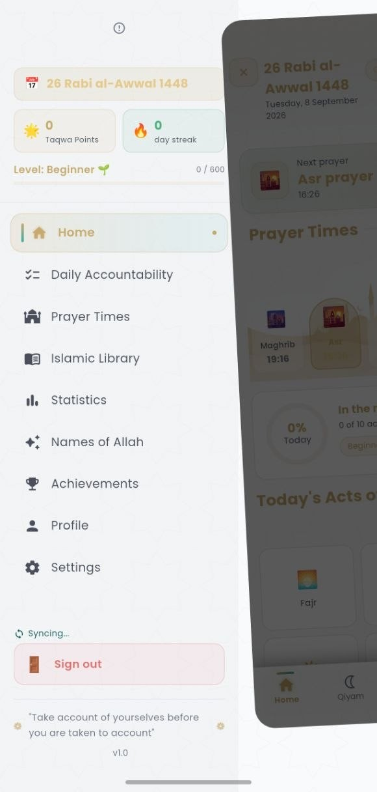
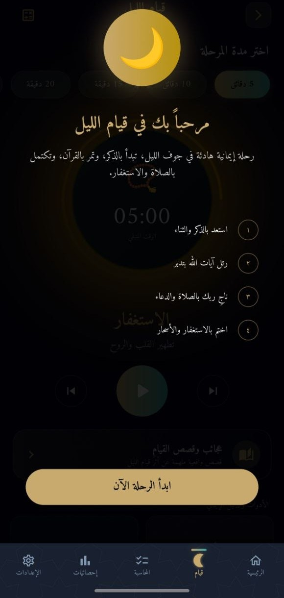
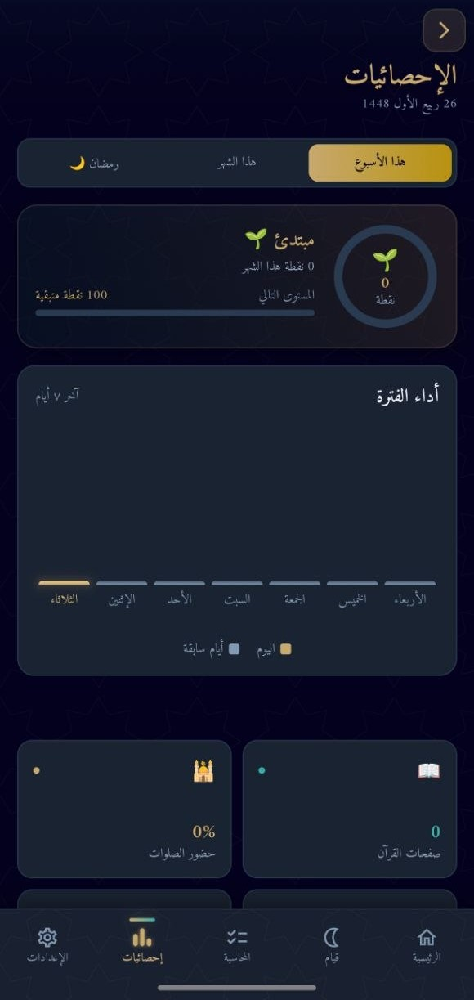
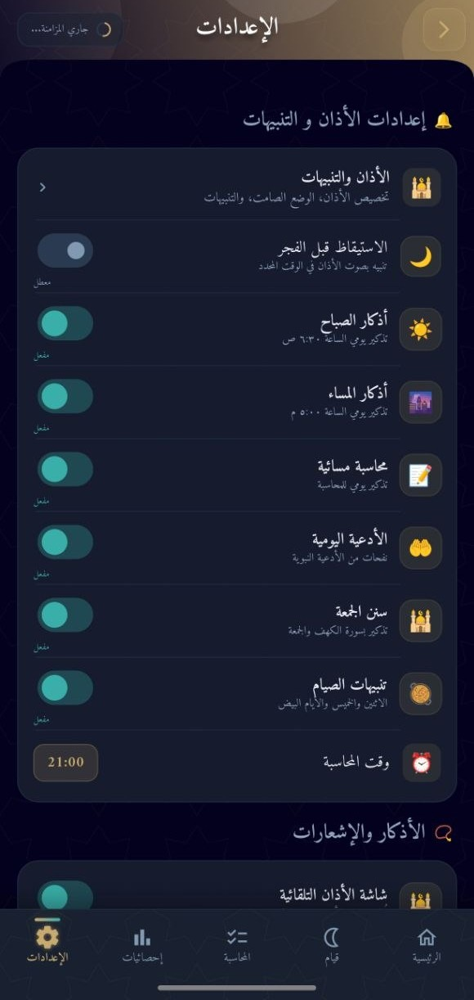

<div align="center">


# تقوى · Takwa

**A Premium Islamic Companion — Mobile & Web**

_"حاسبوا أنفسكم قبل أن تُحاسبوا"_  
_Hold yourselves accountable before you are held accountable._

[](https://github.com/Imad-Ainine/takwa/releases/latest)
[](https://flutter.dev)
[](https://nextjs.org)
[](LICENSE)
[](https://github.com/Imad-Ainine/takwa/actions/workflows/mobile-ci.yml)

[📥 Download APK](https://github.com/Imad-Ainine/takwa/releases/latest) · [🌐 Web App](https://takwa-web.vercel.app/) · [📋 Changelog](https://github.com/Imad-Ainine/takwa/releases)

</div>

---

## 📱 Screenshots

<div align="center">













</div>

---

## ✨ Features

| Feature | Description |
|---------|-------------|
| 🕌 **Prayer Times** | Accurate daily prayer schedule with location-aware adhan alerts |
| 📿 **Dhikr & Tasbeeh** | Digital tasbeeh counter with curated remembrance collections |
| 📖 **Quran** | Full Quran with Arabic text, translations, and tafsir |
| 🧭 **Qibla Compass** | Real-time compass pointing towards the Kaaba |
| 🌙 **Hijri Calendar** | Integrated Islamic calendar with occasions and events |
| 🤲 **Daily Accountability** | Track your daily good deeds, prayers, and spiritual goals |
| 🔔 **Smart Notifications** | Adhan notifications with flip-to-silence and wake-screen support |
| 📊 **Qada Prayer Tracker** | Log and track missed prayers to make them up |
| 🌟 **Sadaqah Tracker** | Record and reflect on your daily charity |
| 🏠 **Home Screen Widget** | At-a-glance prayer times right on your Android home screen |
| 🌐 **Web Companion** | Full-featured web dashboard at [takwa-web.vercel.app](https://takwa-web.vercel.app/) |

---

## 📥 Download & Install

### Android

1. Go to [**Releases**](https://github.com/Imad-Ainine/takwa/releases/latest) and download `takwa-vX.X.X.apk`
2. On your Android device, enable **Install from unknown sources** (Settings → Security)
3. Open the downloaded APK to install

### iOS (TestFlight)

iOS builds are distributed via TestFlight. See [`docs/ios-testflight-setup.md`](docs/ios-testflight-setup.md) for the setup guide.

---

## 🏗️ Tech Stack

| Layer | Technology |
|-------|-----------|
| **Mobile** | Flutter 3, Dart |
| **State Management** | Riverpod |
| **Local Database** | Drift (SQLite) |
| **Prayer Times** | Adhan library |
| **Backend** | Supabase |
| **Push Notifications** | Firebase Cloud Messaging |
| **Web** | Next.js 15, React 19, TypeScript, Tailwind CSS |
| **Monorepo** | Melos, NPM Workspaces |

---

## 📂 Project Structure

```
takwa/
├── apps/
│   ├── mobile/          # Flutter mobile application
│   └── web/             # Next.js web application
├── packages/
│   ├── takwa_core/      # Shared domain logic
│   └── takwa_ui/        # Shared design system components
├── docs/                # Architecture & feature specs
└── .github/workflows/   # CI/CD pipelines
```

---

## 🚀 Getting Started

### Prerequisites

- [Flutter SDK](https://docs.flutter.dev/get-started/install) (3.x stable)
- [Node.js](https://nodejs.org/) (18+)
- [Melos](https://melos.invertase.dev): `dart pub global activate melos`

### Setup

```bash
# 1. Clone the repository
git clone https://github.com/Imad-Ainine/takwa.git
cd takwa

# 2. Bootstrap all Flutter packages
npm run mobile:bootstrap

# 3. Copy and fill in environment variables
cp apps/mobile/.env.example apps/mobile/.env
```

### Run

| App | Command |
|-----|---------|
| **Mobile** | `cd apps/mobile && flutter run` |
| **Web** | `npm run web:dev` |

---

## 🛠️ Monorepo Commands

| Command | Description |
|---------|-------------|
| `npm run mobile:bootstrap` | Bootstrap all Flutter packages via Melos |
| `npm run mobile:clean` | Clean all Flutter build artifacts |
| `npm run web:dev` | Start the Next.js dev server |
| `npm run web:build` | Build the web app for production |

---

## 🚢 CI / CD

| Workflow | Trigger | What it does |
|----------|---------|-------------|
| `mobile-ci.yml` | Push / PR to `main` | Analyze + test on Linux |
| `release-apk.yml` | `v*.*.*` tag or manual | Build signed APK → GitHub Release |
| `release-testflight.yml` | `v*.*.*` tag | Build signed IPA → TestFlight |
| `deploy-web.yml` | Push to `main` | Deploy web app to Vercel |

### Creating a new release

```bash
# Tag and push — the release workflow runs automatically
git tag v1.5.6
git push origin v1.5.6
```

Or trigger manually from **Actions → Build & Release APK → Run workflow**.

---

## 🤝 Contributing

1. Fork the repository
2. Create a feature branch: `git checkout -b feat/your-feature`
3. Commit your changes: `git commit -m 'feat: add your feature'`
4. Push and open a Pull Request

Please make sure `flutter analyze` and `flutter test` pass before opening a PR.

---

## 📜 License

MIT © [Imad Ainine](https://github.com/Imad-Ainine)

---

<div align="center">


Made with ❤️ for the Muslim community

</div>
